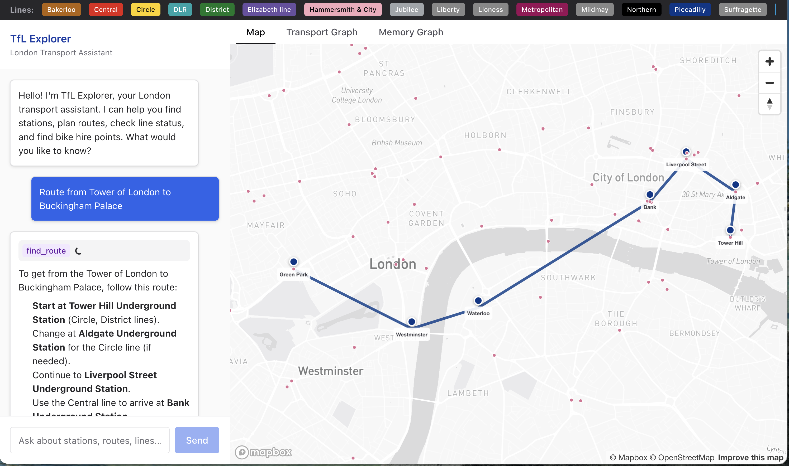

# Transport for MAF

A conversational London transport assistant powered by the Microsoft Agent Framework (MAF), Neo4j Agent Memory, and Transport for London data. Features a three-panel interface with chat, interactive map, and graph visualization.



## Architecture

```
Frontend (Next.js + Chakra UI)     Backend (FastAPI + MAF Agent)      Database (Neo4j)
+----------------------------+     +----------------------------+     +------------------+
| ChatPanel (SSE streaming)  |     | POST /chat (SSE)           |     | Station nodes    |
| TransportMap (Mapbox GL)   | --> | Transport tools (spatial,  | --> | Line nodes       |
| TransportGraph (Neo4j NVL) |     |   routes, live status)     |     | BikePoint nodes  |
| MemoryGraph (Neo4j NVL)    |     | Memory tools (preferences, |     | NEXT_STOP rels   |
| DetailPanel                |     |   entities, traces)        |     | ON_LINE rels     |
+----------------------------+     +----------------------------+     | Spatial indexes  |
                                            |                         +------------------+
                                            v
                                   TfL Unified API (live status)
```

**Key technologies:**

- **Backend**: FastAPI, Microsoft Agent Framework, neo4j-agent-memory, OpenAI GPT-4o
- **Frontend**: Next.js 14, React 18, Chakra UI v3, Neo4j NVL, Mapbox GL JS, Zustand
- **Database**: Neo4j 5 with APOC, spatial indexes, and point() coordinates
- **Data**: TfL Unified API (stations, lines, routes, bike points, live disruptions)

## Prerequisites

- [Neo4j](https://console.neo4j.io/) (Neo4j Aura free tier or any other Neo4j instance)
- [uv](https://docs.astral.sh/uv/) (Python package manager)
- [Node.js](https://nodejs.org/) 18+ and npm
- [OpenAI API key](https://platform.openai.com/api-keys)
- [Mapbox access token](https://account.mapbox.com/access-tokens/) (for the map)
- TfL API key (optional, increases rate limits) from [TfL API portal](https://api-portal.tfl.gov.uk/)

## Quick Start

### 1. Environment setup

```bash
cp .env.example .env
# Edit .env with your API keys:
#   OPENAI_API_KEY=sk-...
#   NEXT_PUBLIC_MAPBOX_TOKEN=pk....
```

### 2. Start Neo4j

```bash
make docker-up
```

Neo4j Browser will be available at http://localhost:7474 (neo4j/password).

### 3. Load transport data

```bash
make install
make data-refresh   # Downloads TfL data + loads into Neo4j
```

This downloads station, line, route, and bike point data from the TfL API, then creates the transport graph in Neo4j with spatial indexes and relationships.

### 4. Run the application

```bash
make dev
```

This starts both servers concurrently:
- **Backend**: http://localhost:8000 (FastAPI + Swagger docs at /docs)
- **Frontend**: http://localhost:3000

## Project Structure

```
transport-for-maf/
  docker-compose.yml        # Neo4j 5 Enterprise with APOC
  Makefile                  # Development commands
  .env.example              # Environment variable template

  cypher/
    schema.cypher           # Constraints, spatial indexes, text indexes
    sample_queries.cypher   # Example geospatial and traversal queries

  scripts/
    download_tfl_data.py    # Download stations, lines, routes, bike points from TfL API
    load_graph.py           # Load JSON data into Neo4j graph

  backend/
    pyproject.toml          # Python deps (uv managed)
    app/
      main.py               # FastAPI server, SSE chat, REST endpoints
      agent.py              # MAF agent with transport + memory tools
      config.py             # Settings from environment
      memory_setup.py       # Neo4j Agent Memory lifecycle
      tfl_client.py         # Live TfL API client
      tools/
        transport.py        # 10 agent tools (spatial search, routing, status)
    tests/
      conftest.py           # Shared fixtures and mocks
      unit/                 # Fast isolated tests (no external deps)
      integration/          # API endpoint + Neo4j graph tests
      e2e/                  # Smoke tests against running server

  frontend/
    package.json            # Node.js deps
    src/
      app/
        page.tsx            # Three-panel layout
      components/
        chat/ChatPanel.tsx          # SSE streaming chat
        map/TransportMap.tsx        # Mapbox GL map with station markers
        graph/TransportGraphView.tsx # Neo4j NVL transport graph
        graph/MemoryGraphView.tsx    # Neo4j NVL memory graph
        detail/DetailPanel.tsx       # Station/line detail sidebar
        LineStatusBanner.tsx         # Clickable line badges (loads line network into map + graph)
      lib/
        api.ts              # Backend API client
        types.ts            # TypeScript interfaces
        graphStyles.ts      # NVL node/edge styling, TfL line colors
      store/
        useAppStore.ts      # Zustand global state
```

## Agent Tools

The agent has access to 10 transport tools and 6 memory tools:

**Transport tools** (query Neo4j graph + live TfL API):
| Tool | Description |
|------|-------------|
| `find_nearest_stations` | Spatial point.distance() query for stations near coordinates |
| `search_station` | Fuzzy text search on station names |
| `get_station_details` | Full station info with lines, bike points, interchanges |
| `find_route` | Shortest path over NEXT_STOP relationships |
| `get_line_stations` | All stations on a line in sequence order |
| `find_bike_points` | Spatial search for nearby cycle hire docking stations |
| `get_line_status` | Live disruption status from TfL API |
| `get_disruptions` | Current network disruptions from TfL API |
| `execute_cypher` | Read-only Cypher execution (validated) |
| `get_graph_schema` | Neo4j graph schema introspection |

**Memory tools** (from neo4j-agent-memory):
- `search_memory` - Search conversation history and entities
- `remember_preference` / `recall_preferences` - Persistent user preferences
- `remember_fact` / `search_knowledge` - Long-term entity knowledge
- `find_similar_tasks` - Reasoning trace retrieval

Each transport tool returns JSON with `graph_data` (nodes/relationships for NVL visualization) and `map_markers` (coordinates for Mapbox), enabling the chat to drive map and graph updates.

## Neo4j Graph Model

```
(:Station {naptanId, name, location: point(), lat, lon, zone, modes})
(:Line {lineId, name, modeName, color})
(:BikePoint {id, name, location: point(), lat, lon, nbDocks, nbBikes})
(:Zone {number})

(:Station)-[:ON_LINE {sequence}]->(:Line)
(:Station)-[:NEXT_STOP {lineId}]->(:Station)
(:Station)-[:INTERCHANGE_WITH]->(:Station)
(:Station)-[:IN_ZONE]->(:Zone)
(:BikePoint)-[:NEAR_STATION {distance}]->(:Station)
```

Spatial indexes enable sub-millisecond geospatial queries using `point.distance()`.

## API Endpoints

| Method | Path | Description |
|--------|------|-------------|
| POST | `/chat` | SSE streaming chat |
| POST | `/chat/sync` | Non-streaming chat |
| GET | `/health` | Health check |
| GET | `/stations` | All stations with coordinates |
| GET | `/stations/{id}` | Station details |
| GET | `/stations/nearby?lat=&lon=&radius=` | Spatial station search |
| GET | `/lines` | All lines with colors |
| GET | `/lines/{id}/stations` | Stations on a line |
| GET | `/lines/{id}/graph` | Full line subgraph (stations, zones, bike points) |
| GET | `/bikepoints/nearby?lat=&lon=` | Nearby bike points |
| GET | `/graph/neighborhood/{id}` | Graph node expansion |
| GET | `/disruptions` | Live disruptions |
| GET | `/memory/context?session_id=` | Memory context |
| GET | `/memory/graph?session_id=` | Memory graph for NVL |
| GET | `/memory/preferences?session_id=` | User preferences |

## Testing

```bash
cd backend

# Unit tests (fast, no external deps)
uv run pytest tests/ -m unit

# Integration tests (API endpoints with mocked DB)
uv run pytest tests/integration/test_api_endpoints.py -m integration

# Integration tests (Neo4j - requires running instance or testcontainers)
uv run pytest tests/integration/test_neo4j_graph.py -m integration

# E2E smoke tests (requires running backend + Neo4j)
uv run pytest tests/e2e/ -m e2e

# All non-E2E tests
uv run pytest tests/ -m "unit or integration"

# With coverage
uv run pytest tests/ -m "unit or integration" --cov=app --cov-report=term-missing
```

## Development Commands

```bash
make install            # Install all dependencies (backend + frontend)
make dev                # Start both servers concurrently
make dev-backend        # Backend only (port 8000)
make dev-frontend       # Frontend only (port 3000)
make docker-up          # Start Neo4j
make docker-down        # Stop Neo4j
make download-tfl       # Download data from TfL API
make load-data          # Load data into Neo4j
make data-refresh       # Download + load
make clean              # Remove generated files
```

## Memory Features

The agent uses three types of memory via neo4j-agent-memory:

- **Short-term**: Conversation messages within a session (full history passed to agent for multi-turn context)
- **Long-term**: Entities extracted from conversations (stations, lines mentioned) and user preferences (e.g., "I prefer step-free access"). Entity extraction uses LLM-based extraction via OpenAI.
- **Reasoning traces**: Records of tool calls and outcomes for similar-task retrieval

Memory operations after response generation (saving assistant messages and reasoning traces) run asynchronously to avoid blocking the SSE stream.

Memory persists across sessions in Neo4j and is visualized in the Memory Graph tab.

## License

MIT
